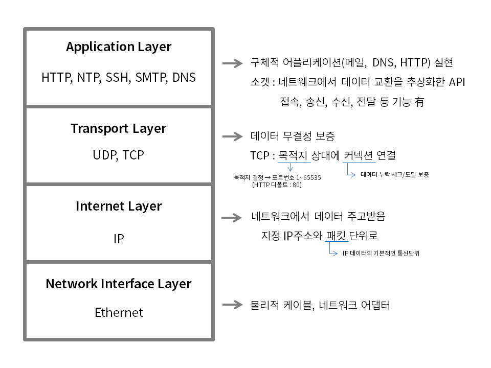
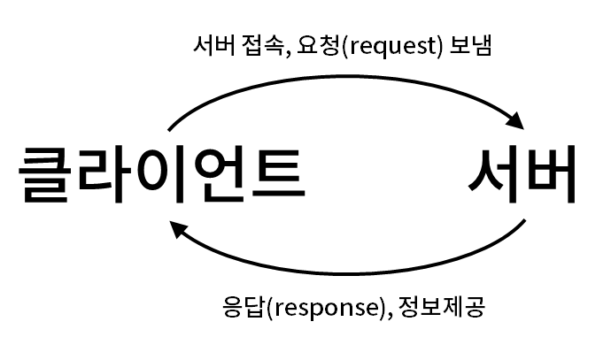
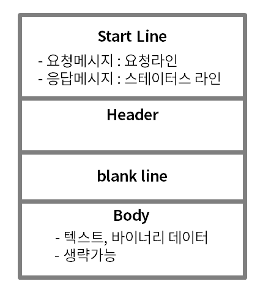

## 3부 HTTP - Ch. 6 HTTP의 기본

### 02. TCP/IP란

HTTP는 TCP/IP를 기반으로 한다. TPC와 IP는 인터넷의 토대를 구성하는 네트워크 프로토콜이다. 

#### 계층형 프로토콜

인터넷 네트워크 프로토콜을 계증구조로 추상화해 구현하면 하위 계증의 물리적 사항에 좌우되지 않고 상위계층 구현이 가능하다.



#### 네트워크 인터페이스 계층

- 장 아래 계층으로 물리적인 케이블이나 네트워크 어댑터에 해당하는 부분이다. 
- 이더넷

#### 인터넷 계층

- 데이터를 주고받는 것을 담당한다. 
- TCP/IP에서 IP가 여기에 해당한다.
- IP의 데이터 기본통신단위를 패킷이라고 한다.
- 지정한 IP 주소와 패킷 단위로 데이터를 주고받으며 통신한다.

#### 트랜스포트 계층

- 데이터의 무결성을 보증하는 역할
- TCP/IP에서 TCP에 해당
- TCP가 목적지 상대에 커넥션을 연결하면 이 커넥션을 사용해 데이터의 누락 체크와 떼이터 도달을 보증한다.
- 데이터의 목적지를 결정하는 것이 포트번호이다.
- 서버에서 자주 사용하는 번호에는 디폴트 번호가 할당되어 있다. (HTTP는 80번 포트 사용)

#### 애플리케이션 계층

- 구체적인 인터넷 애플리케이션(메일, DNS, HTTP)를 실현하는 계층
- TCP 프로그램에서 소켓 라이브러리 사용
- 소켓은 네트워크에서 데이터 교환을 추상화한 API로 접속, 송신, 수신, 절단 등의 기본적인 기능을 갖고있다.
- HTTP 서버와 브라우저는 소켓을 이용해 구현한다.

---

### 03. HTTP 버전

#### HTTP 0.9 - 탄생

- 현재의 HTTP와 다르게 헤더가 없다.
- 메서드가 GET 밖에 없다.

#### HTTP 1.0 - 최초의 표준화

- IEFE에서 표준화된 최초버전
- 브라우저 전쟁이 치열한 시기에 스펙 책정작업이 진행되었다.
- 헤어 도입, GET 이외 메서드 추가 등
- 상호운용성이 완벽하진 않았지만 HTTP 1.1로 가는 발판이 되었다.

#### HTTP 1.1 - 완성

- 최초 버전은 RFC 2068(1997), 그후 개정을 거쳐 현재는 RFC 2616(1999) 발행
- HTTP 1.0 + 채널전송, Accept 헤더에 의한 콘텐트 네고시에이션, 복잡한 캐시 컨트롤, 지속적 연결 등의 기능 추가

#### 그 후의 HTTP

- HTTP 자체 가치를 REST 아키테게처 스타일에서 찾은 결과 HTTP 1.1의 효과적 활용이 현대적인 개발 스타일이 되었다.
- [HTTP Bis](http://j.mp/httpbis/) - HTTP 1.1 스펙의 완성도를 향상시키기 위해 2008년부터 시작된 작업

---

### 04. 클라이언트와 서버



---

### 05. 요청과 응답

HTTP는 요청/응답형프로토콜이면서 동기형 프로토콜이다. 

- 요청/응답형 프로토콜은 클라이언트가 내보낸 요청을 서버에서 처리하고 응답한다.
- 동기형 프로토콜은 서버에서 처리시간이 아무리 길어도 요청을 보낸 클라이언트는 응답이 돌아올때까지 대기한다.

#### 요청과 응답 예

클라이언트가 DNS를 사용해 inhalin.github.io의 호스트 이름을 해석하고 그 결과로 얻은 IP 주소의 TCP 80번 포트에 접속하고 요청을 전송한다.

```
GET HTTP/1.1
Host: inhalin.github.io
```

서버는 요청을 읽고 해석해 응답을 보낸다. inhalin.github.io의 서버로부터 응답이 돌아온다.

```
HTTP/1.1 200 OK
//생략

<!DOCTYPE html>
<html>
<head>
//이하생략
```

#### 클라이언트에서 일어나는 일

    1. 요청 메시지 구축
    2. 요청 메시지 송신
    3. 응답 대기
    4. 응답 메시지 수신
    4. 응답 메시지 해석
    6. 클라이언트 목적 달성을 위한 처리 수행

4.의 결과에 따라 재요청이 필요한 경우도 있다.

#### 서버에서 일어나는 일

    1. 요청 대기
    2. 요청 메시지 수신
    3. 요청 메시지 해석
    4. 적절한 애플리케이션 프로그램으로 처리 위임
    5. 애플리케이션 프로그램에서 결과 취득
    6. 응답 메시지 구축
    7. 응답 메시지 송신

---

### 06. HTTP 메시지

- HTTP 메시지 = 요청메시지 + 응답메시지

#### 요청메시지


> 예시

```
GET /categories HTTP/1.1
Host: inhalin.github.io:8080
```

1. 요청라인 Request-Line
	- 요청 메시지의 첫번째 라인을 요청라인이라고 한다.
	- 메서드, 요청 URI, 프로토콜 버전으로 구성된다.
	- 예시에서 메서드는 GET, 요청 URI는 /categories, 프로토콜 버전은 HTTP/1.1이다.
	- 요청라인에는 경로 이후의 문자열이 온다. 
	- 포트번호는 Host 헤더에서 지정한다.
	- 요청 URI는 경로 이후의 문자열 또는 절대 URI가 된다. 절대URI를 사용한 경우 Host 헤더는 생략 가능하다.

2. 헤더
	- 요청 메시지 두번째 줄부터 헤더이다.
	- 헤더는 메타데이터이다.
	- 하나의 메세지는 복수의 헤더를 가질 수 있다.
	- 각 헤더는 ‘이름:값’의 구성을 하고 있다.

3. 바디
	- 바디에는 메시지를 나타내는 본질적인 정보가 들어간다.

#### 응답 메시지

> 예시

```
HTTP/1.1 200 OK
Content-Type: application/xhtml+xml: charset=utf-8

<html>
//생략
</html>
```

1. 스테이터스 라인
	- 응답 메시지의 첫번째 줄이 스테이터스 라인이다.
	- 프로토콜 버전, 스테이터스 코드, 텍스트 구문으로 구성된다.
	- 예시에 프로토콜 버전은 HTTP/1.1, 스테이터스 코드는 200, 텍스트 구문은 OK이다.
	- 스테이터스 코드는 요청 결과를 프로그램 처리 가능한 수치코드로 표현한다.

2. 헤더
	- 응답 메시지 두번째 줄부터 헤더이다.

3. 바디
	- 헤더와 바디는 빈줄로 구문된다. 예시에는 바디에 HTML이 포함되어 있다.

#### HTTP 메시지 구성요소



### 07. HTTP의 스테이트리스성

스테이트리스 : 서버가 클라이언트의 어플리케이션 상태를 보존하지 않는다는 제약

#### 스테이트풀 vs 스테이트리스

| 방식 | 스테이트풀 | 스테이트리스 |
|---|---|---|
| 특징 | 간결함 | 장황함 |
| | 서버가 애플리케이션 상태 기억 | 클라이언트가 애플리케이션 상태를 <ins>자기 기술적 메시지*</ins>로 송신 |
| 프로토콜 종류 | FTP | HTTP |
| 장점 | 상대경로 지정가능, 에러시 요청 처리 여부 확인가능 | 서버 시스템이 단순 -> 시스템 확장이 간단함 |
| 단점 | 클라이언트 수가 증가할때 규모 확장이 어려움 | 송신할 데이터 양 많아짐, 부하 걸리는 처리 반복 -> 퍼포먼스 저하 |

세션은 시스템 로그인부터 로그아웃까지 일련의 조작을 말하고 이 세션 조작 중의 상태를 애플리케이션 상태라고 한다.

```
애플리케이션 상태 = 세션 상태(Session State)
```

<ins>자기 기술적 메시지</ins> : 요청을 처리하는 데 필요한 정보가 모두 포함되어 있는 메시지

### 08 심플한 프로토콜의 강점

HTTP의 가장 큰 특징은 심플함이다. 그 덕분에 브라우저는 PC뿐만 아니라 다양한 디바이스에서도 구현할 수 있고, 웹 서비스와 웹 API가 같은 프로토콜로 실현될 수 있는 것이다.
